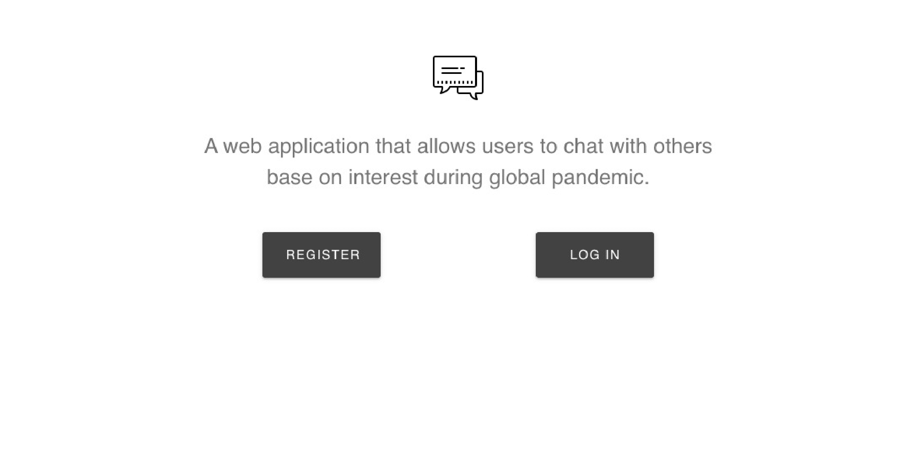
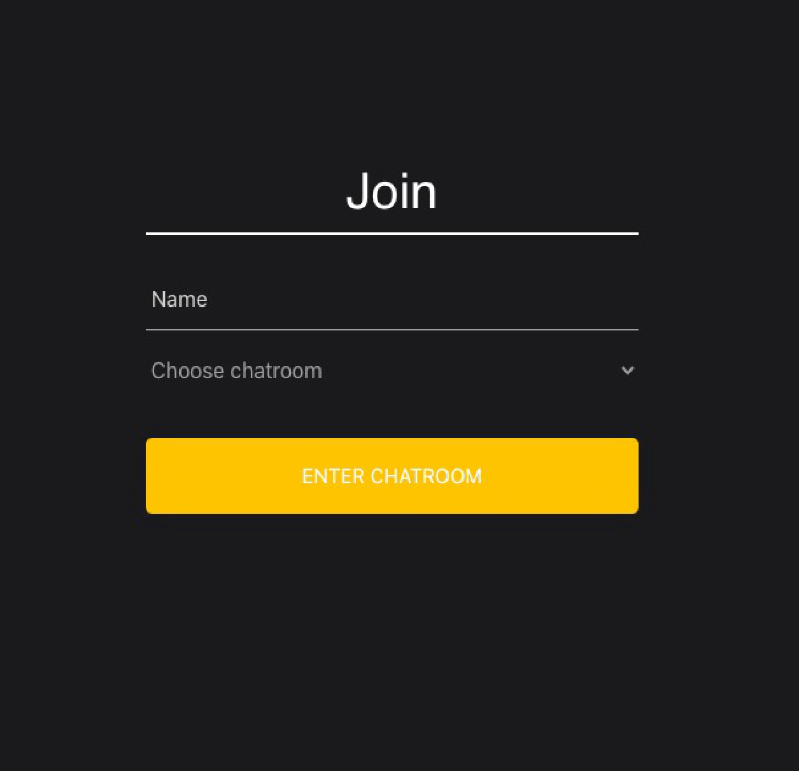

## Quarantine React Web Chat App
Our Quaranchill website is a way to reconnect with other people. Quaranchill is a fully fledged world chat system separated by hobbies to facilitate better communication between users. We used a Node.js express and React framework to create this app. The home page displays a basic user login using BCrypt technology. We used Socket.Io, a JavaScript library for realtime web applications to create this group chat system. We used React Bootstrap for UI, and MongoDB for database management.

## Deployed App
https://quaranchill.herokuapp.com/dashboard

## Instruction
1) Register user account
2) Login with user acccount
3) Click "Join" button to enter chatroom
4) Enter display name and select room base on interest
5) Start chatting!

## Tech Stack
React, MongoDB, Express, Node, Socket.io, Bcrypt, Passport, JWT, Redux, Materialize, Heroku.

## Authors
- Ben Fung - Back End, Routing to Update Database, Authentication, Chatroom
- Sandesh Charka - Front End Javascript Logic for AJAX calls, Login Checks
- Phuong Quyen Le - Front End Design & Implementation
- Colin Chang - Front End Design and Front End Javascript Logic
